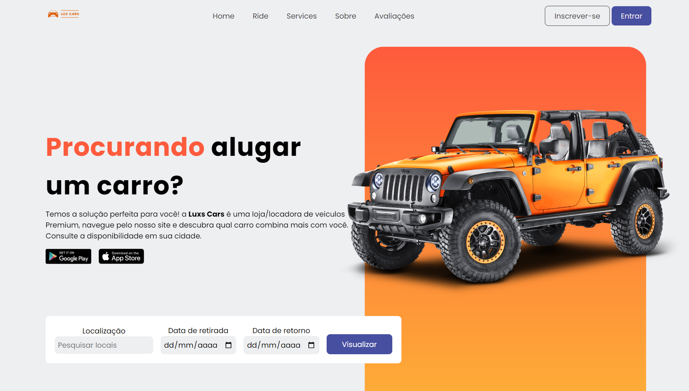

<h1>Lux Cars</h1>

## 📚 About

O website Lux Cars foi desenvolvido com proposito de colocar em prática as habilidades de CSS, HTML e um pouco de Scroll animation com ScrollReveal, com animações suaves no rolamento da página.

## 🛠 Tools

- [HTML](https://developer.mozilla.org/pt-BR/docs/Web/HTML)
- [CSS](https://developer.mozilla.org/pt-BR/docs/Web/CSS)
- [JavaScript](https://developer.mozilla.org/pt-BR/docs/Web/JAVASCRIPT)

## 🧾license

This project is under the MIT license. See the file LISENSE for more details.

<h1 align="center">
<a href="https://luxcarsbr.netlify.app/">See the site</a>
</h1>
